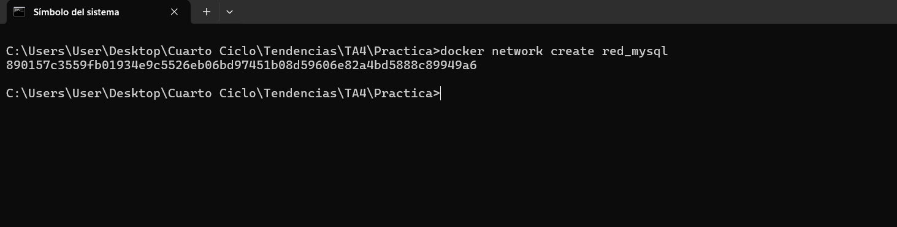
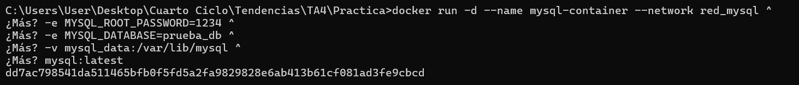
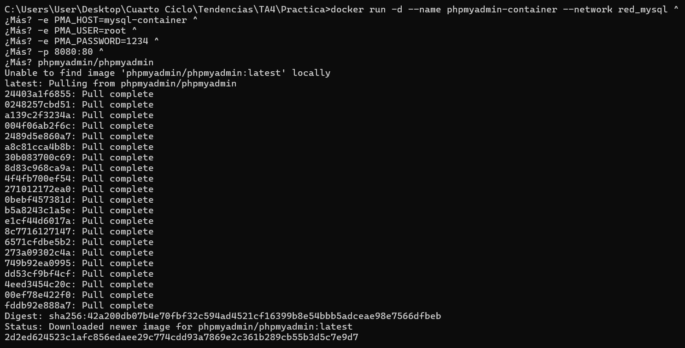
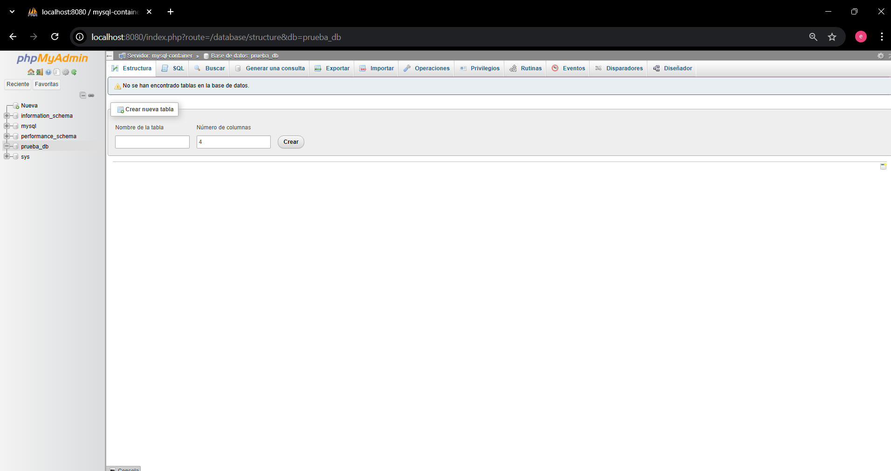

# Práctica TAS4 - Red de contenedores MySQL y phpMyAdmin

## 1. Título
Red de contenedores con MySQL y phpMyAdmin usando Docker.

## 2. Tiempo de duración
90 minutos aproximadamente.

## 3. Fundamentos

Docker es una herramienta que permite ejecutar aplicaciones dentro de contenedores aislados. Estos contenedores son ligeros, portables y reproducibles, lo que facilita el desarrollo y despliegue de aplicaciones.  
En esta práctica se trabajó con **dos contenedores principales**: uno para **MySQL** y otro para **phpMyAdmin**, conectados mediante una red personalizada de Docker.

**MySQL** es un sistema gestor de bases de datos relacional, utilizado ampliamente para almacenar información estructurada.  
**phpMyAdmin** es una herramienta web que facilita la administración de bases de datos MySQL mediante una interfaz gráfica accesible desde el navegador.

Para que ambos contenedores se comuniquen correctamente, se requiere crear una **red personalizada** dentro de Docker. Esto permite que los contenedores puedan identificarse por nombre en lugar de direcciones IP, mejorando la organización y el aislamiento del entorno.


### Conceptos importantes:
- **Red de Docker:** Permite la comunicación entre contenedores sin exponer puertos innecesarios al exterior.
- **Variables de entorno (-e):** Se usan para definir contraseñas, usuarios y configuraciones al crear un contenedor.
- **Puertos (-p):** Permiten acceder desde el host al servicio dentro del contenedor.

---

## 4. Conocimientos previos
Para esta practica se debe conocer:
- Comandos básicos de Docker (`docker run`, `docker ps`, `docker network`, `docker exec`).
- Conceptos básicos de bases de datos MySQL.
- Uso de navegadores web para acceder a `localhost`.

---

## 5. Objetivos
- Crear y configurar un contenedor con **MySQL**.
- Crear y configurar un contenedor con **phpMyAdmin**.
- Establecer una **red personalizada** en Docker.
- Probar la comunicación entre ambos contenedores.
- Crear una base de datos de prueba desde phpMyAdmin.

---

## 6. Equipo necesario
- Computador con Docker instalado (Docker Desktop o Docker Engine).
- Conexión a Internet.
- Navegador web (Chrome, Firefox o Edge).

---

## 7. Material de apoyo
- [Documentación oficial de MySQL Docker](https://hub.docker.com/_/mysql)
- [Documentación oficial de phpMyAdmin Docker](https://hub.docker.com/_/phpmyadmin)
- Guía de la asignatura

---

## 8. Procedimiento

### Paso 1: Crear la red personalizada
Se creó una red de Docker que permite la comunicación entre ambos contenedores:

```cmd
docker network create red_mysql
```
**Figura 1-1. Creación de red personalizada.**  


---

### Paso 2: Crear el contenedor de MySQL
Se creó el contenedor de la base de datos con las variables de entorno necesarias:

```cmd
docker run -d --name mysql-container --network red_mysql ^
 -e MYSQL_ROOT_PASSWORD=1234 ^
 -e MYSQL_DATABASE=prueba_db ^
 -v mysql_data:/var/lib/mysql ^
 mysql:latest
```
**Figura 2-2. Creación del contenedor MySQL.**  


---

### Paso 3: Crear el contenedor de phpMyAdmin
Posteriormente, se ejecutó el contenedor phpMyAdmin conectado a la misma red:

```cmd
docker run -d --name phpmyadmin-container --network red_mysql ^
 -e PMA_HOST=mysql-container ^
 -e PMA_USER=root ^
 -e PMA_PASSWORD=1234 ^
 -p 8080:80 ^
 phpmyadmin/phpmyadmin
```
**Figura 2-3. Creación del contenedor phpMyAdmin.**  


---

### Paso 4: Verificar contenedores activos
Para comprobar que ambos contenedores se estén ejecutando correctamente:

```cmd
docker ps
```
**Figura 2-4. Contenedores activos.**  


---

### Paso 5: Acceso a phpMyAdmin
Se accedió al servicio phpMyAdmin desde el navegador mediante la URL:

```
http://localhost:8080
```
**Usuario:** root  
**Contraseña:** 1234  

**Figura 2-5. phpMyAdmin funcionando correctamente.**  


---

## 9. Resultados esperados
- Ambos contenedores (MySQL y phpMyAdmin) deben estar en ejecución y conectados por la red `red_mysql`.
- phpMyAdmin debe permitir el acceso a la base de datos `prueba_db`.
- Se debe poder crear tablas y visualizar la estructura de datos.
- Los contenedores deben poder reiniciarse sin pérdida de información gracias al volumen `mysql_data`.

**Figura 3-1. Resultado final: interfaz de phpMyAdmin con base de datos creada.**  


## 10. Bibliografía

Docker Inc. (2024). *Docker documentation*. https://docs.docker.com/

Oracle Corporation. (2024). *MySQL Docker image documentation*. Docker Hub. https://hub.docker.com/_/mysql

phpMyAdmin Team. (2024). *phpMyAdmin image documentation*. Docker Hub. https://hub.docker.com/_/phpmyadmin

